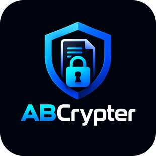

# ABCrypter

### Cryptography Engineering Platform

**Encrypt anything. Trust no one.**

A quiet, offline platform for people and businesses who take their data seriously.

[**Download**](#-download) · [**Features**](#-features) · [**Pricing**](#-pricing) · [**Enterprise**](#-enterprise--professionals) · [**Website**](https://lancelotech-app.github.io/abcrypter/)

---

## 🎯 What is ABCrypter?

ABCrypter is a **native desktop cryptography platform** that encrypts and
decrypts text and files with password-protected blocks. Built entirely in
**Rust**, it runs 100% offline — no cloud, no telemetry, no accounts.

Whether you're protecting API keys, securing sensitive notes before sending
them to cloud storage, or deploying encrypted pipelines for your business,
ABCrypter gives you cryptographic control without compromise.

> **Philosophy:** *Your data stays on your machine. Your key stays in your hands.*

---

## 📥 Download

Native builds for every desktop. Pick the version that matches your system.

| Platform | Architecture | Status |
|---|---|---|
| **Windows** | x64 (64-bit) | ✅ Available |
| **Windows** | x86 (32-bit) | ✅ Available |
| **macOS** | Apple Silicon (arm64) | (SOON) |
| **macOS** | Intel (x64) | (SOON) |
| **Linux** | AppImage (universal) | (SOON) |
| **Linux** | `.deb` (Debian / Ubuntu) | (SOON) |
| **Linux** | `.rpm` (Fedora / RHEL) | (SOON) |

👉 **[View all releases →](https://github.com/lancelotech-app/abcrypter/releases)**

### Direct download

Visit the **[official download page](https://lancelotech-app.github.io/abcrypter/)**
for the latest builds, or grab the newest release directly:

---

## ✨ Features

### Core (Free)

- 🔐 **Unique codes, every time** — No two encryptions ever match, even for the same input
- 🗝️ **Protect keys & sensitive data** — Secure API keys, credentials, and confidential notes
- ☁️ **Cloud-safe by design** — Encrypt before sending to any cloud service
- 📜 **Full local history** — Track every encryption, decryption, and saved element
- 🦀 **Rust engine** — Memory-safe, fast, and reliable
- 📦 **Export as `.txt` or `.zip`** — Read-only encrypted files

### Premium Custom

- 📈 **Up to 1,000,000 characters** per encryption (vs 5,000 in Free)
- 📦 **Integrated encrypted cloud** — Store your info in encrypted form
- 📧 **Verified identity encryption** — Password + verified email or phone
- 🤝 **Selective sharing** — Grant access to chosen third parties
- 💬 **Encrypted messaging** — Fully encrypted discussions
- 🏢 **Enterprise integration** — Pipelines for banks, stores, and services
- 🧩 **Custom cryptography services** — Tailored to your infrastructure
- 📄 **Additional export formats** — `.md`, `.txt`, `.zip`
- 🎫 **Custom license for professionals**

---

## 🦀 Built in Rust

ABCrypter is built entirely in **Rust** — the language chosen by Mozilla, AWS,
Cloudflare, Microsoft, and the Linux kernel for the most security-critical
systems on the planet.

| Guarantee | Description |
|---|---|
| **Memory-safe by design** | Entire classes of vulnerabilities eliminated at compile time — buffer overflows, use-after-free, data races |
| **Zero undefined behavior** | Every operation is verified before the binary is even built |
| **Native performance** | Compiled directly to machine code — no interpreter, no VM, no garbage collector |
| **Trusted by the industry** | Used in production by Dropbox, Discord, Figma, Cloudflare, Firefox, and the Linux kernel |
| **Auditable & minimal** | Small, dependency-conscious codebase — fewer moving parts, fewer attack surfaces |
| **Cross-platform native** | One codebase, real native builds for Windows, macOS, and Linux |

---

## 🔬 See it in action

**Before — plain text:**

A unique, password-protected block. Useless without the key — even if
intercepted or stored in the cloud.

---

## 💰 Pricing

### Free — `$0 / forever`

- Up to **5,000 characters** per encryption
- Password-protected blocks
- Export as `.txt` or `.zip`
- 100% offline — no account required
- Rust engine

### Premium — `Custom / quote`

- Up to **1,000,000 characters**
- Integrated encrypted Cloud storage
- Full history (local & cloud)
- Encrypted messaging & discussions
- Verified sharing (email / phone)
- Custom infrastructure & deployment
- Export as `.md`, `.txt`, `.zip`
- Encrypted API integration
- Custom license for professionals
- Priority support & dedicated contact

---

## 🏢 Enterprise & Professionals

We build encrypted pipelines for **businesses, banks, e-commerce, and
professionals**. Tell us about your infrastructure and we'll send you a
custom quote — adapted to your specific needs.

📧 **Contact:** [lancelotech@proton.com](mailto:lancelotech@proton.com)

---

## 🛠 Tech Stack

- **[Rust](https://www.rust-lang.org/)** — Core cryptography engine
- **[Tauri](https://tauri.app/)** — Native desktop framework
- **[Cargo](https://doc.rust-lang.org/cargo/)** — Build system

---

## 📚 Resources

| Resource | Link |
|---|---|
| 🌐 Official website | [lancelotech-app.github.io/abcrypter](https://lancelotech-app.github.io/abcrypter/) |
| 📦 Latest release | [github.com/lancelotech-app/abcrypter/releases](https://github.com/lancelotech-app/abcrypter/releases) |
| 🐛 Report a bug | [Issues](https://github.com/lancelotech-app/abcrypter/issues) |
| 💬 Discussions | [GitHub Discussions](https://github.com/lancelotech-app/abcrypter/discussions) |
| 📧 Contact | [lancelotech@proton.com](mailto:lancelotech@proton.com) |

---

## ⚖️ License

ABCrypter is **proprietary software**. All rights reserved.

The Free tier is available at no cost for personal use. The Premium tier
requires a commercial license — [contact us](mailto:lancelotech@proton.com)
for details.

---

**ABCrypter — Cryptography Engineering Platform**

*Encrypt anything. Trust no one.*

Made with 🦀 by [Lancelotech](https://github.com/lancelotech-app)

